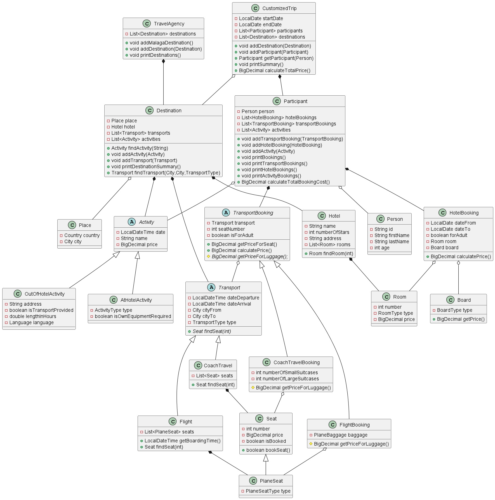

The project consists of creating number of classes that would reflect process of booking a trip in the travel agency.  
The customized trip among others consists of  
- list of destinations (each has a hotel and set of activities).  
Chosen destinations are the same for all group of trip participants.
Participants can travel to many destinations during one trip.
- list of hotel bookings (that has info about room and board type)  
Hotel bookings are individual for each participant. Each participant can have many hotel bookings as can travel to many 
destinations.
- list of flights  
Flights are individual for each participant. Each participant can have many flights as can travel to many
  destinations.

Travel Agency class simulates situation when the family of 4 would like to buy a trip to Malaga in Spain from 5th
to 15th of May 2022. They have a list of requirements concerning flight, rooms and activities at destination place.

At the end program will print info about the trip containing:
- date
- total cost
- participants
- destinations with chosen activities
- booking of hotels and flights per participant

