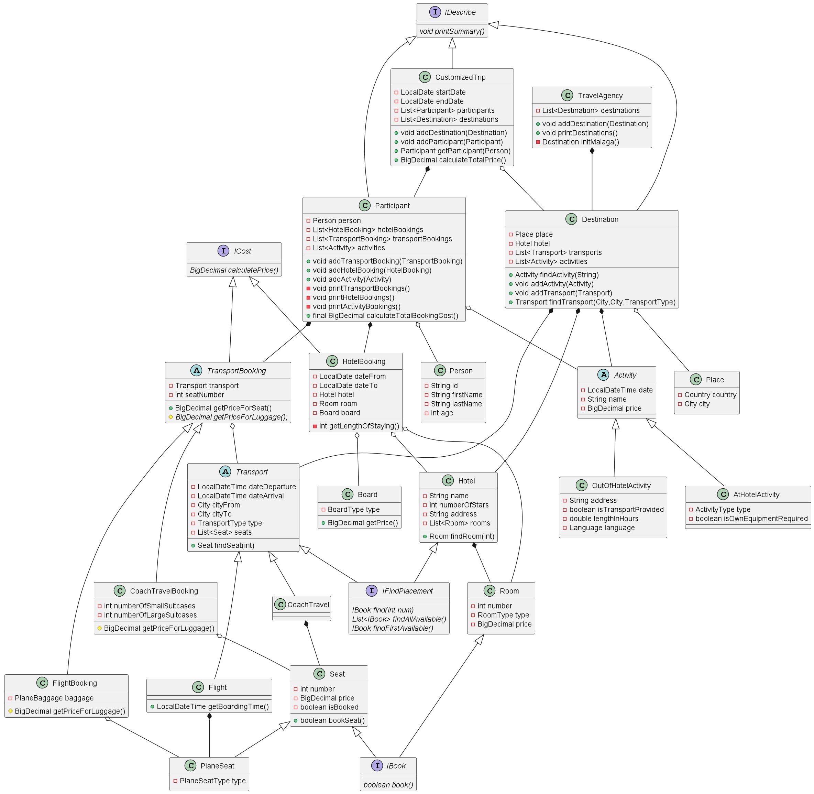

The project consists of creating number of classes that would reflect process of **booking a trip** at the travel agency.  
The customized trip among others consists of:  
- list of destinations (each has a hotel and set of available activities).  
Chosen destinations are the same for all group of trip participants.
Participants can travel to many destinations during one trip.
- list of participants. Each participant can have their own activities, hotel and transport bookings based on own preferences.

The program starts with travel agency initialization with:  
- one destination [Malaga in Spain]
- set of possible transports (by plane or bus) from Warsaw to Malaga and back

Trip Booking class simulates situation when the family of 4 would like to buy a trip to Malaga from 5th
to 15th of May 2022. They have a list of requirements concerning means of transport, rooms and activities at destination place.

At the end program prints info about the trip containing:
- date
- total cost
- participants
- destinations with chosen activities
- booking of hotels, transport and activities per participant

Additionally, in some classes own implementation of equal, hashcode and toString methods is added.

Diagram below shows **class dependencies** applied in the program (without setters, getters, equals, hashcode and toString methods) 
